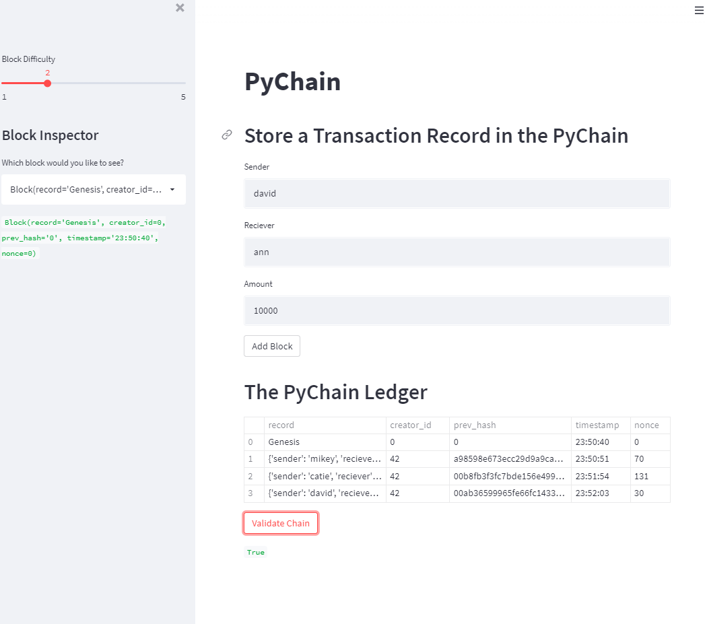

# module_18_challenge

The module 18 challenge for fintech course

The python file creates a rudimentary blockchain that stores data in blocks and secures it via cryptographic hashing.

---

## Technologies

The sheet requires streamlit for running the program in a web browser.
The sheet imports pandas as well.

---

## Installation Guide

Other than Python 3.7, streamlit is required and teh file runs in a browser, chrome works well. Launch the file by navigating to the directory of the file through a CLI and then running "streamlit run pychain.py"

streamlit can be installed form the CLI with the following:

pip install streamlit

---

## Usage

The worksheet allows users to input block data and store it in the displayed blocks.  A butoon at the bottom willensure the data has not been changed by checking the hashes.

---

## Contributors

Michael Canavan

---

## License

The content of the course is owned and managed by UC Berkeley Fintech Bootcamp.